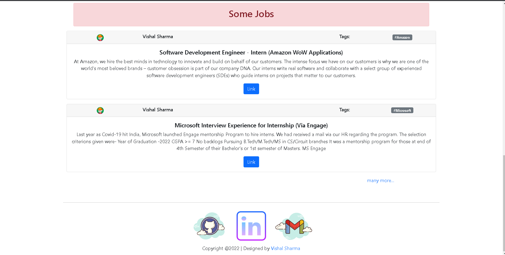

# Full Stack (MERN) Peer to peer Websites for Jobs and Resources

## About
This project Tells About latest Job Updates and Upcoming Contests of Different Websites .Website also contain Resources of Differnet Domains.
[Website Link](https://peertopeerconnect.herokuapp.com/)

## Detail
- Build web application that will Tells About latest Job Updates and Upcoming Contests of Different Websites at a single Website.

- Making Responsive and interactive web application Frontend Using Reactjs.

- Build backend service which will handle frontend request and send predicted data to frontend Using (Nodejs and Expressjs).

- Build Apis which will responsible to get and post Resources ,Upcomping Contests and Job data. 

- Data Was Stored in Mongodb from Frontend and Get Data from Backend and Show on Frontend.

Tech Stack:

-React Js

-Express Js

-Node Js

-Mongodb

## Website Frontend
1. Home Page

2. Contest Page

3. Jobs Page

4. Resources Page

5. Login Page

6. Register Page

